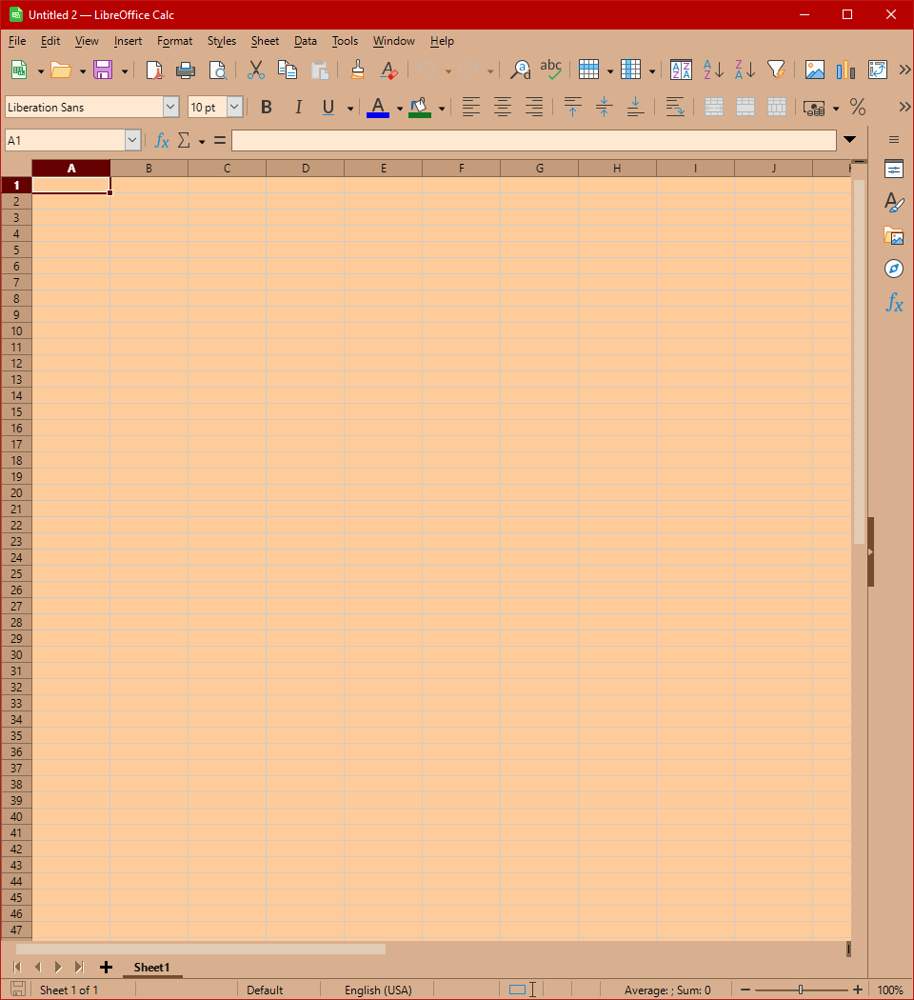

# Jane's Coffee Theme for LibreOffice

Jane's Coffee for LibreOffice is a easy for eyes theme with beautiful milk coffee colors: light brown, brown and orange accents. To activate it, the theme must first be loaded from Tools > Extensions > Add, then restart LO. To show the theme properly go to Tools > Options > Appearance > and from LibreOffice Themes select Jane's Coffee and chose to [v] Enable application theming, disable [ ] Use white document background and disable [ ] Use bitmap for application background.

## Gallery

